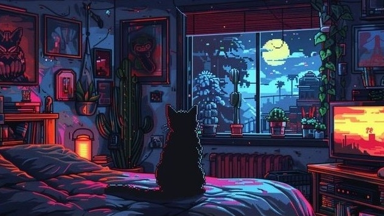

    
    <h1 align="center">Me Website</h1>

<a href="https://github.com/zer0code9" style="text-decoration: none">

    

</a>
<a href="https://github.com/zer0code9/meWesbite" style="text-decoration: none">

    
    
    
    

</a>

    

This is my portfolio website for all my projects.

Made by zer0code